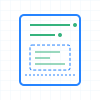

# json-schema-viewer

<div align="center">
  
  
  
</div>

[](LICENSE) [](CONTRIBUTING.md)

Welcome to JSON Schema Viewer!

Try it out today at: https://json-schema.app

JSON Schema is awesome. It lets you define and validate the schema for your JSON object and is used to define many many JSON structures. 
For example schemas, please see: https://www.schemastore.org/json/ 

However, as great as the format is, without familiarity, it is often very difficult to read JSON Schema and understand exactly what JSON 
is allowed by the schema. Well, fear not! JSON Schema Viewer to the rescue: just paste a link to your JSON Schema and it will be 
rendered beautifully, comprehensively and with examples describing the JSON you should expect at evely level of the hierarchy.

## Logo Design

The three logo variations represent different aspects of JSON Schema Viewer:

- **Geometric**: Nested rectangles and shapes representing the hierarchical structure of JSON objects and schemas, with clean geometric forms that scale well at any size.
- **Lens**: A magnifying glass revealing JSON structure, symbolizing the tool's ability to make complex schemas clear and understandable.
- **Blueprint**: Technical blueprint aesthetic with grid background and connection lines, representing schemas as architectural plans for data structures.

Each design uses a minimal color palette of Atlassian blue (#2684FF) and green (#36B37E), ensuring brand consistency while maintaining clarity and modern appeal.

## Usage

To run this project locally:

1. Run `yarn` to install the dependencies.
1. (Optional, automatically runs on install) Run `yarn gen-schema` to generate source from schema.
1. Run `yarn start` to start Webpack Dev server

Now open: http://localhost:8080 to see the site and develop it live.

## Deployment

To publish new SPA website resources to this AWS stack (this is the most common operation you will perform):

``` shell
nix-shell -p awscli2
yarn build-and-upload
```

To deploy this project in a way that updates the AWS Configuration via Cloud Formation:

``` shell
nix-shell -p awscli2
yarn build-and-deploy
```

## Documentation

This project is a React SPA that is designed to be deployed to AWS CloudFront. It implements a Schema Explorer for JSON Schema and does not build an abstraction
layer between JSON Schema and the UI layer. We currently support JSON Schema Draft 07 in the code.

## Tests

There are currently no tests for this project. Instead, we use and browse the react storybooks to ensure that the schema is being rendered correctly.

## Contributions

Contributions to json-schema-viewer are welcome! Please see [CONTRIBUTING.md](CONTRIBUTING.md) for details. 

## License

Copyright (c) 2021 Atlassian and others.
Apache 2.0 licensed, see [LICENSE](LICENSE) file.

<br/> 

[](https://www.atlassian.com)
